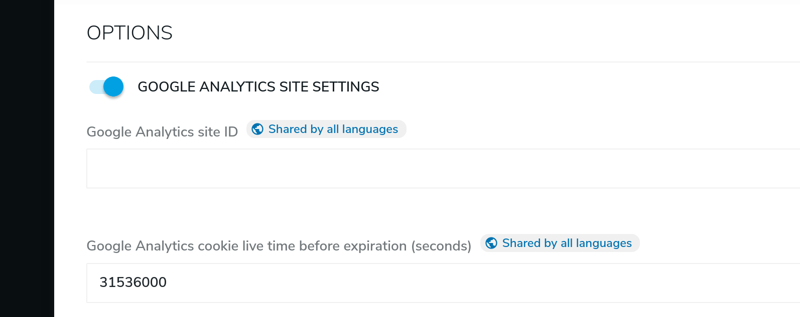

# Google Analytics site settings
Jahia offer to you an easy way to include your google analytics tag in your html page. To configure this feature follow the next steps :
1. From `Page Composer`
2. Right click the site name (in our case *Industrial*) and click `Edit`

    

3. In the edit form look for the `Options` section
4. Enable the `Google Analytics site settings` entry :
    1. fill your *Google Analytics site ID*
    1. (optional) update the cookie live time
    
    ![700]
    
[700]: ../images/700_google_analytics.png
