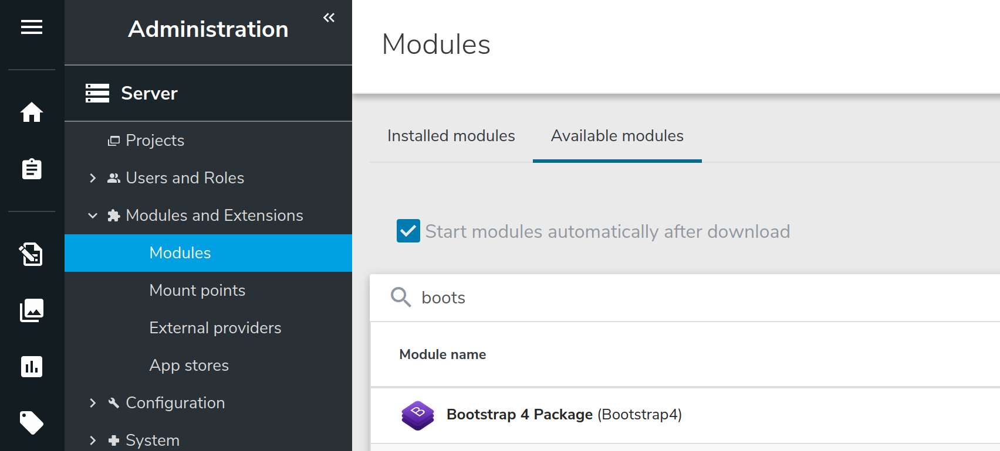
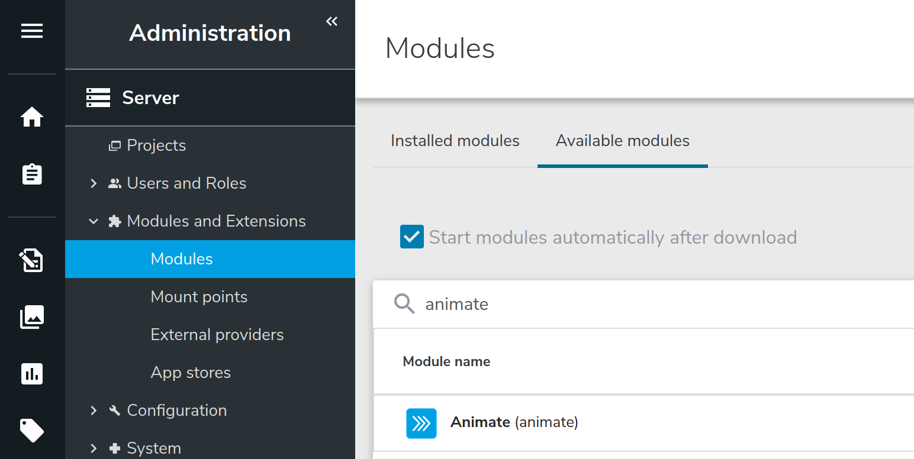
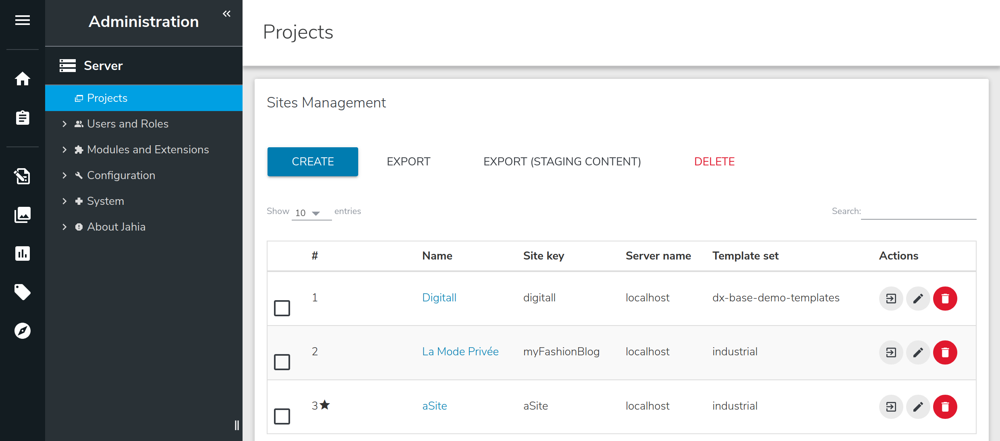
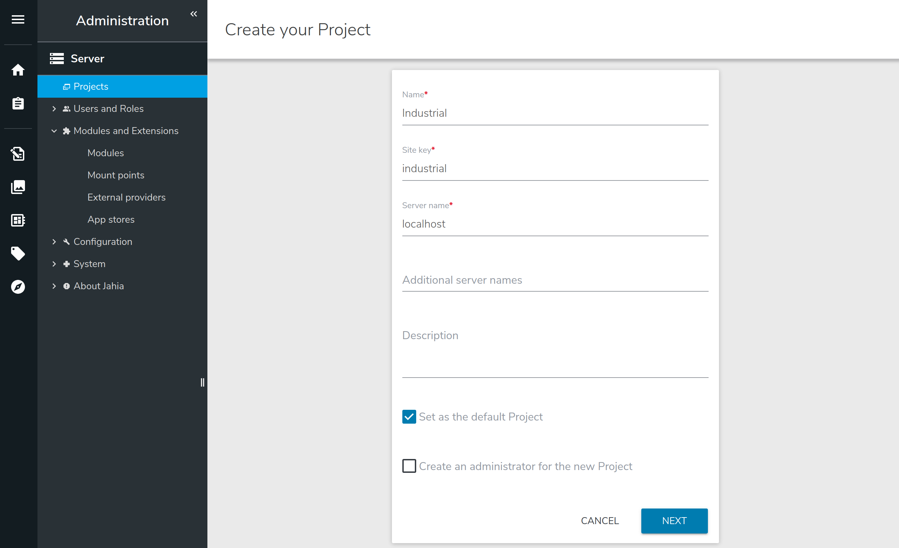
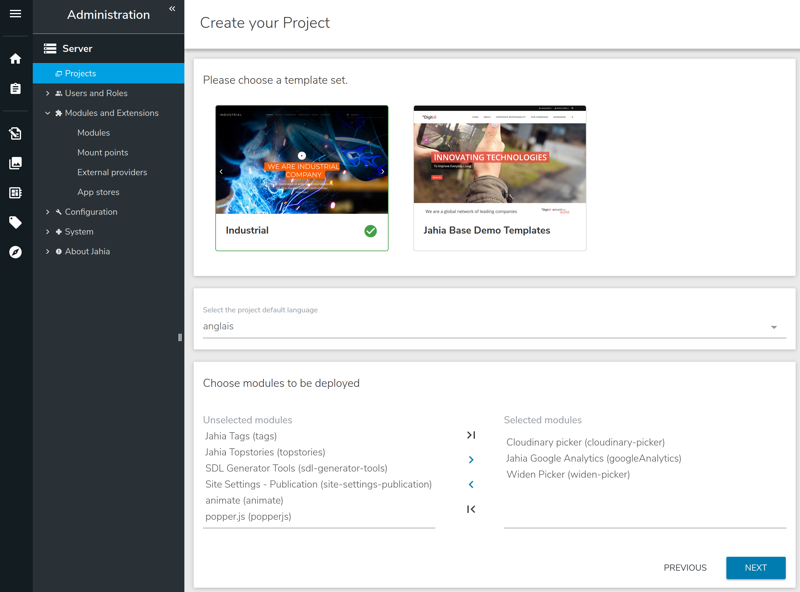
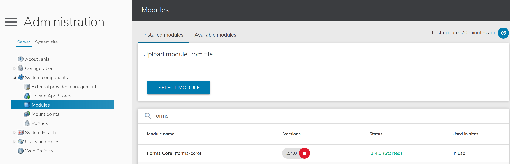
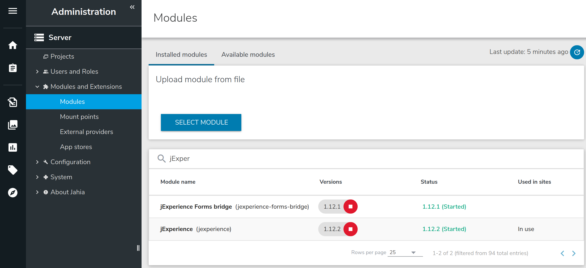

# industrial

* [English](../../README.md)

Ce module a été pensé et conçu pour être utilisé par une équipe de web-marketing.
Il permet de créer rapidement et facilement des pages d'accueil de campagne marketing ou des microsites.
Le module contient un template, quatre pages d'exemples et une collection de bloc HTML prêt à l'emploi :

* Carousel (2 types : heading et témoignage)

    
    
    
    
* Une gallerie d'image

    
    
* Features list

    
    
* Cards elements

    
    
* Text and illustration

    
    
* Navigation bar
* Footer components (about, contact, navigation)
* ...

This module contains a Jahia ready to use implementation of the free template [industrial](https://colorlib.com/wp/template/industrial/), based on the open source toolkit [Bootstrap 4](https://getbootstrap.com/docs/).
Following the concept of bootstrap 4, the template can be modified or used as his.

## Install
Industrial Template Set module depends on :
1. bootstrap 4
1. animate

Thus, before to install and run the Industrial module we need to ensure dependencies are satisfied

### Install dependences

#### Install the module `Bootstrap 4 Package` : 
1. Goto `Administration` mode
1. Expand `System components` entry and click `Modules`
1. In the right panel click on top `Available modules` and search for *Bootstrap 4 Package*

    
    
1. Click the icon  in the right of the package to download and install the module

#### Install the module `animate` : 
1. Goto `Administration` mode
1. Expand `System components` entry and click `Modules`
1. In the right panel click on top `Available modules` and search for *animate*

    
    
1. Click the icon  in the right of the package to download and install the module

### Install the Industrial module

Now the dependence is installed, industrial module is ready to deploy.

To install and deploy the module `Industrial` follow the next steps : 
1. Goto `Administration` mode
1. Expand `System components` entry and click `Modules`
1. In the right panel click on top `Available modules` and search for *Industrial*

    
    
1. Click the icon  in the right of the package to download and install the module

## Create a new website using `industrial` template set

The module industrial is now installed and ready to use. The module is a Jahia *template set*, it is enabled when a new website is created.

To create a new website using `industrial` follow the next steps :
1. Goto `Administration` mode
1. Click `Web Projects` entry and click `CREATE` in the right panel

    

1. Fill the website name and key with the name you want and click NEXT

    

1. Select the template set `industrial`
1. Choose modules to be deployed :
    1. `Bootstrap 4 Components` : this enable all default bootstrap 4 elements as the usefull `Layout and Grid`
    1. `Jahia Google Analytics` : this enable the `Google Analytics site settings` entry used to include your google analytics tag (explained later)
    
    

## Use Jahia `Forms` and `jExperience` with an Industrial website
Jahia offers an extension to build and deploy easily HTML Forms. In addition, form's fields can be mapped to User profile attribute. Values are stored in *jCustomer* through *jExperience*.
### Enable `Forms` and `jExperience`
Before to use *Forms* and *jExperience* ensure modules are deployed in *jContent*

#### Check if `Forms` is installed
1. Goto `Administration` mode
1. Expand `System components` entry and click `Modules`
1. Search if `Forms core` is available

    

If module is not deployed ...

#### Check if `jExperience` & `jExperience Forms bridge` are installed
Jahia offer the capability to map form's fields to User profile attribute. Values are stored in *jCustomer* through *jExperience*. To enable this great feature, jCustomer needs 2 modules :
1. `jExperience`
1. `jExperience Forms bridge`

Thus, we need to check if the required module are available in our instance :

1. Goto `Administration` mode
1. Expand `System components` entry and click `Modules`
1. Search if `jExperience` & `jExperience Forms bridge` are available

    

If module is not deployed ...

Then activate both for you sitecd ..

When modules are available for your website you can find new entry in the settings tab of your website

## Google Analytics site settings
Jahia offer to you an easy way to include your google analytics tag in your html page. To configure this feature follow the next steps :
1. Goto `Edit Mode`
1. In `PAGES` menu right click your site name and click `Edit`
1. In the edit form goto `Options` section
1. Enable the `Google Analytics site settings` entry :
    1. fill your *Google Analytics site ID*
    1. (optional) update the cookie live time
